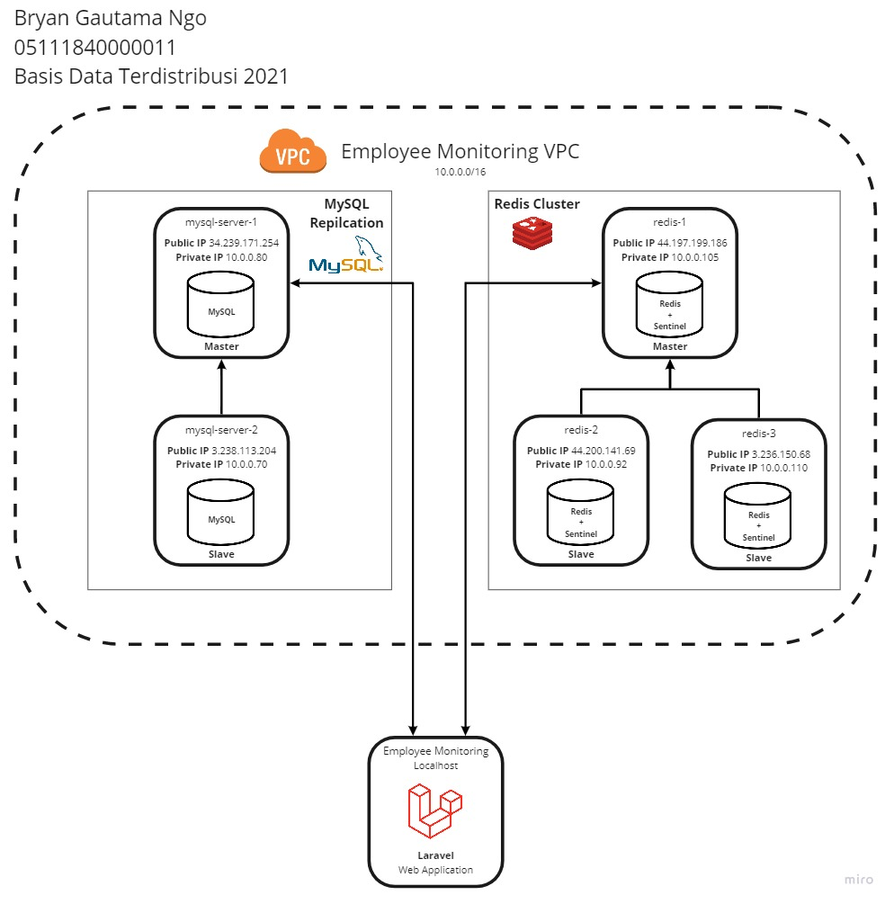

# EAS Basis Data Terdistribusi 2021

Bryan Gautama Ngo - 05111840000011

## Arsitektur Sistem dan Basis Data

## Konfigurasi Basis Data

1. MySQL Master: [mysqld.cnf](./config/mysql/master-mysqld.cnf.txt)
2. MySQL Slave: [mysqld.cnf](./config/mysql/slave-mysqld.cnf.txt)
3. Redis: [redis.conf](./config/redis/redis.conf)
4. Redis Sentinel: [sentinel.conf](./config/redis/sentinel.conf)
5. Redis Sentinel Servuice: [sentinel.service](./config/redis/sentinel.service.txt)